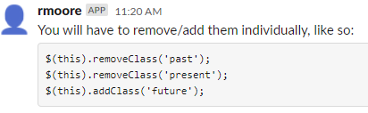

# 05-Challenge-Work-Day-Scheduler
Third-Party APIs Challenge: Work Day Scheduler

User Story

AS AN employee with a busy schedule
I WANT to add important events to a daily planner
SO THAT I can manage my time effectively

Acceptance Criteria

GIVEN I am using a daily planner to create a schedule

WHEN I open the planner

THEN the current day is displayed at the top of the calendar

WHEN I scroll down

THEN I am presented with time blocks for standard business hours of 9am to 5pm

WHEN I view the time blocks for that day

THEN each time block is color-coded to indicate whether it is in the past,
 present, or future

WHEN I click into a time block

THEN I can enter an event

WHEN I click the save button for that time block

THEN the text for that event is saved in local storage

WHEN I refresh the page

THEN the saved events persist

Create a simple calendar application that allows a user to save events for each hour of a typical working day (9am–5pm). This app will run in the browser and feature dynamically updated HTML and CSS powered by jQuery.

The starter code uses the Day.jsLinks to an external site. library to work with date and time, but feel free to use a different JavaScript solution to handle this functionality.

[day.js.org](https://day.js.org/docs/en/installation/node-js)

const dayjs = require('dayjs')

**ask-296418 Learning Assistant Help:**

**Asked for help from Classmate Shawn Meister**

